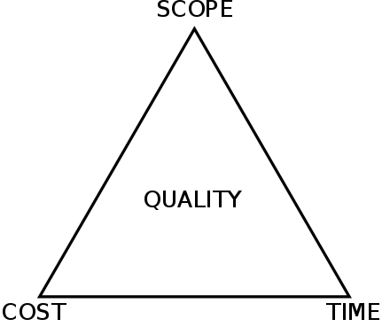

# Estimating and Prioritizing

---

# Effort vs Impact

---

# Estimating Work
https://www.pointingpoker.com/

- 1 Point: a straightforward task that requires minimal implementation and integration effort. (half workday)

- 3 Points: involves some additional functionality, but is still relatively simple to implement. (1-2 workdays)

- 5 Points: involves moderate effort. (3 workdays)

- 8 Points: requires a significant amount of effort. (~5 workdays)

- 13 Points: a more challenging and time-consuming task. (~10 workdays)

---

# Pointing Poker

As a user, I want to be able to search for products by their name, so that I can quickly find the items I'm interested in.

---

# Pointing Poker

As a user, I want to be able to register with my email and password, so that I can create an account and access the application.

---
# Pointing Poker

As a user, I want to receive email notifications whenever my order status changes, so that I can stay updated on the progress of my purchases.

---
# Pointing Poker

As a user, I want to be able to upload a profile picture, so that I can personalize my profile.

---
# Pointing Poker

As a user, I want to be able to create and manage multiple shopping lists, so that I can categorize my desired items for different occasions or stores.

---

# Takeaways?

---
# Project Management Triangle

[source](https://en.wikipedia.org/wiki/Project_management_triangle)

- It's much easier to decide on a budget/timeline, then pare down an initial feature set based on these constraints.

---

# Further Reading

- [A guide to producing software estimates](https://www.atlassian.com/agile/estimation)

- [A counterpoint: Why software estimation is a losing game](https://rclayton.silvrback.com/software-estimation-is-a-losing-game)

I tend to agree with the latter ^

- [Building software with David Heinemeier Hansson](https://medium.com/computers-are-hard/computers-are-hard-building-software-with-david-heinemeier-hansson-c9025cdf225e)

- [Flaws in Scrum and Agile](https://pandastrike.com/posts/20150304-agile/)